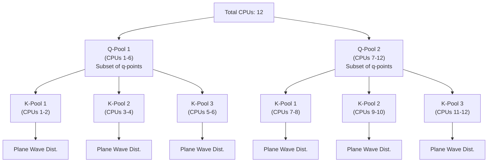

# Usage

This guide details the complete workflow for using **LetzElPhC**, from generating the initial DFT data to performing the final electron-phonon matrix element calculations and interpolations.

The workflow is divided into three main sections:

1.  **Running Basic DFT**: Generating the necessary electronic and phononic data using Quantum Espresso.
2.  **Running the Electron-Phonon Calculation**: Computing the electron-phonon matrix elements on a coarse grid.
3.  **Interpolation Calculation**: Interpolating the results to a finer grid.

---

## 1. Running Basic DFT

Before using LetzElPhC, you must generate the necessary electronic and phononic databases using Quantum Espresso (QE).

### 1.1 SCF Calculation
Perform a self-consistent field (SCF) calculation with `pw.x` to find the ground state of your system.

**Important:** Ensure you use symmorphic symmetries if required by your Yambo version or setup.

```fortran
&system
  ...
  force_symmorphic=.true.
  ...
/
```

### 1.2 DFPT Calculation (Phonons)
Run `ph.x` to obtain dynamical matrices and potential changes ($\delta V_{SCF}$) on a uniform q-point grid.

*   **Crucial**: You must set `dvscf = .true.` (or ensure `fildvscf` is set) to save the potential changes required by LetzElPhC.
*   The phonon q-grid must be commensurate with the k-grid used in the next step.

```fortran
prefix_dvscf
&inputph
  tr2_ph = 1.0d-14,
  verbosity = 'high'
  prefix = 'prefix',
  fildvscf = 'prefix-dvscf',   ! Essential: Saves potential changes
  electron_phonon = 'dvscf',
  fildyn = 'prefix.dyn',
  ldisp = .true.,
  nq1 = Nx, nq2 = Ny, nq3 = Nz
/
```

### 1.3 NSCF Calculation
Run `pw.x` (NSCF) to obtain wavefunctions on a uniform k-point grid.
*   The k-grid must be commensurate with the phonon q-grid used in the DFPT calculation.

```fortran
K_POINTS automatic
Nx Ny Nz 0 0 0
```

### 1.4 Yambo Initialization
Initialize the Yambo database from the NSCF results.

1.  Navigate to the NSCF `prefix.save` directory.
2.  Run `p2y` to convert the QE data to Yambo format.
3.  Run `yambo` to initialize the `SAVE` folder.

---

## 2. Running the Electron-Phonon Calculation

Once the basic DFT data is ready, you can compute the electron-phonon matrix elements using LetzElPhC.

### 2.1 Preprocessing
First, prepare the phonon data for LetzElPhC using the built-in preprocessor.

1.  Navigate to your phonon calculation directory.
2.  Run the `lelphc` preprocessor:
    ```bash
    lelphc -pp --code=qe -F PH.X_input_file
    ```
    *   `PH.X_input_file`: The input file used for `ph.x` in step 1.2.
3.  This creates a **`ph_save`** directory containing the necessary files.
    *   *Optional*: You can rename the output directory by setting the environment variable `ELPH_PH_SAVE_DIR`.

### 2.2 Execution
Run the main LetzElPhC calculation.

1.  Ensure you have both the **`SAVE`** directory (from step 1.4) and the **`ph_save`** directory (from step 2.1).
2.  Create an input file (e.g., `lelphc.in`).
3.  Run the code, typically in parallel:
    ```bash
    mpirun -n 4 lelphc -F lelphc.in
    ```

#### Input File Description (`lelphc.in`)

```ini
nkpool          = 1
# Number of MPI pools for k-point parallelization

nqpool          = 1
# Number of MPI pools for q-point parallelization

start_bnd       = 1
# First band to include in the calculation

end_bnd         = 40
# Last band to include in the calculation

save_dir        = SAVE
# Path to the Yambo SAVE directory

ph_save_dir     = ph_save
# Path to the phonon save directory generated by the preprocessor

kernel          = dfpt
# Screening level:
# - dfpt:       DFPT screening (total change in KS potential)
# - dfpt_local: DFPT screening excluding the non-local pseudo part
# - bare:       No screening
# - bare_local: Local part of pseudo only

convention      = standard
# Momentum transfer convention:
# - standard: <k+q|dV|k>  (Stores derived quantities for k -> k+q)
# - yambo:    <k|dV|k-q>  (Stores derived quantities for k -> k-q)
```

### 2.3 Parallelization Scheme

LetzElPhC utilizes a hierarchical parallelization scheme involving **q-pools**, **k-pools**, and **plane-wave** distribution.

!!! danger "Requirement"
    The total number of CPUs must be divisible by `nkpool * nqpool`.

**Example:** Running on **12 CPUs** with `nkpool = 3` and `nqpool = 2`:

1.  **Level 1 (q-pools):** The 12 CPUs are divided into `nqpool = 2` groups. Each group (q-pool) handles a subset of q-points.
    *   Size: 12 / 2 = 6 CPUs per q-pool.
2.  **Level 2 (k-pools):** Each q-pool is further divided into `nkpool = 3` sub-groups. Each sub-group (k-pool) handles a subset of k-points.
    *   Size: 6 / 3 = 2 CPUs per k-pool.
3.  **Level 3 (Plane Waves):** The CPUs within each k-pool (2 CPUs) distribute the plane-waves components.



### 2.4 Yambopy Workflow (Automated)

**Yambopy** can be conveniently used to call LetzElPhC and generate NetCDF databases that can be directly fed into the Yambo code. This automates the preprocessing and execution steps.

#### Requirements
*   LetzElPhC installed and in your PATH.
*   Yambopy installed.

#### Execution
Run the following command in the directory where the `SAVE` folder is located:

```bash
yambopy l2y
```
This command displays help.

#### Examples

**Serial Run**
To run LetzElPhC serially for bands from $n_i$ to $n_f$:
```bash
yambopy l2y -ph path/of/ph_input.in -b n_i n_f
```

**Parallel Run**
For a calculation with 4 `qpools` and 2 `kpools`, specifying the executable path and avoiding deletion of logs:
```bash
yambopy l2y -ph path/of/ph_input.in -b n_i n_f -par 4 2 -lelphc path/to/lelphc_exe -D
```

**Result**
Check the `SAVE` directory for Yambo-compatible databases:
```bash
ls SAVE/ndb.elph*
```

---

## 3. Interpolation Calculation

After computing the matrix elements on the coarse grid, you can interpolate them to a finer grid.

1.  Create an input file for interpolation (e.g., `interpolate.in`).
2.  Run the interpolation executable (e.g., `lelphc_interp`).

#### Input File Description (`interpolate.in`)

```ini
ph_save_dir = ph_save
# Directory containing the coarse grid phonon data

ph_save_interpolation_dir = ph_save_interpolation
# Directory where interpolation results will be saved

interpolate_dvscf = true
# Whether to interpolate the deformation potential (dvscf)

nosym =false 
# Remove symmetries. Can be true/false (or 1/0, .true./.false.)

asr = "simple"
# Type of ASR to apply (e.g., "simple")

loto = false
# Apply LO-TO splitting corrections

loto_dir = 0.1 0.1 0
# Direction approaching Gamma point for LO-TO splitting

nq1 = 1
nq2 = 1
nq3 = 1
# Dimensions of the fine q-point grid for interpolation

write_dVbare = true
# Whether to write the bare potential changes

eta_induced = 1.0
# Ewald parameter for screened interactions

eta_ph = 1.0
# Ewald parameter for phonon dynamical matrices

# qlist_file = ""
# Optional: File containing a specific list of q-points to interpolate
```
